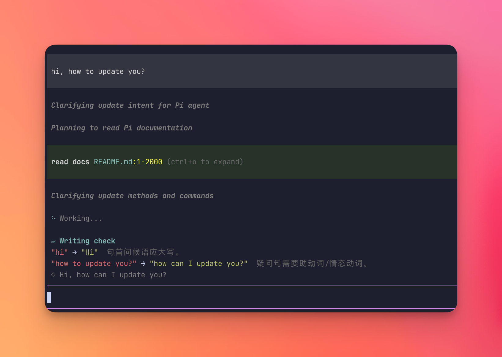
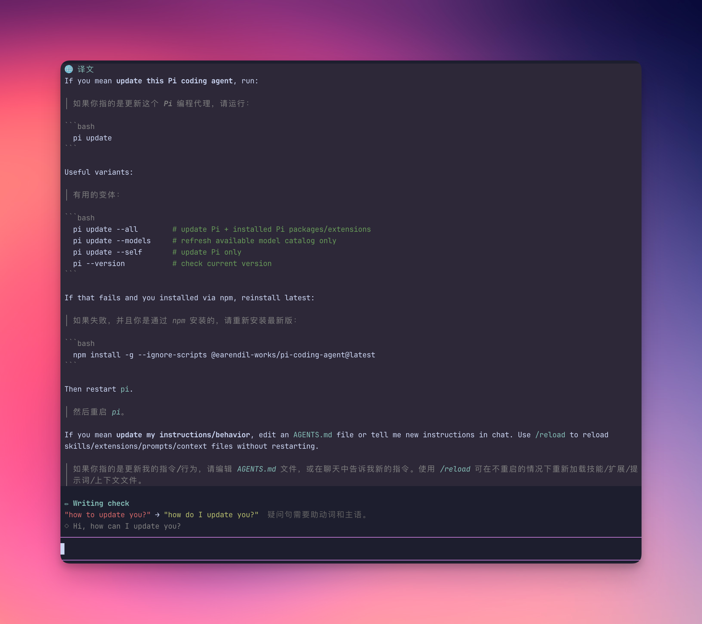

# pi-language-tutor

English | [简体中文](README.zh-CN.md)

Learn a foreign language while you code. A [pi](https://pi.dev) extension that reviews your prompts for spelling, grammar, and natural phrasing — with explanations in your native language — and renders agent replies as bilingual immersive translations.



*You prompt with mistakes, the agent works anyway — and the `✏ Writing check` panel explains each fix in your native language.*

## Install

```sh
pi install npm:pi-language-tutor
```

That is the only required step. The defaults (learning English, native Simplified Chinese) work out of the box. Speak another language? One command: `/lang native ja`.

<details>
<summary>Alternative: install from git, or hack on a local clone</summary>

Install straight from GitHub without npm:

```sh
pi install git:github.com/mackt/pi-language-tutor
```

Or clone and symlink into pi's global extensions directory (auto-discovered via the `pi.extensions` field in package.json, hot-reloads with `/reload`) — best for development, since there is no build step and pi loads TypeScript directly:

```sh
git clone https://github.com/mackt/pi-language-tutor.git
ln -s "$(pwd)/pi-language-tutor" ~/.pi/agent/extensions/pi-language-tutor
```

</details>

## Try this first

1. Start `pi` and send a prompt in your learning language, mistakes and all:

   ```text
   when agent anwser me, I want translate it, it have three feature
   ```

   While the agent answers, a `✏ Writing check` panel appears above the editor: each mistake with its fix and a short explanation in your native language, plus a more natural phrasing of the whole sentence.

2. When the agent finishes, press `alt+t` (macOS: ⌥T — [enable Option-as-Meta](https://iterm2.com/documentation-preferences-profiles-keys.html) in your terminal, or run `/translate`). The response re-renders as a bilingual card: each paragraph followed by its translation.

   

3. Like the bilingual view? Make it automatic:

   ```text
   /lang auto on
   ```

That is enough to start.

## What happens

- **Nothing ever blocks.** Your message goes to the agent immediately; the writing check runs in parallel and the panel appears a moment later. A clean message shows no panel at all.
- **Nothing pollutes the conversation.** Translation cards live only in your terminal — they are never sent back to the LLM and cost no context.
- **You control the spend.** Both features use your session model by default; point them at a cheaper one with `/lang model` and every check becomes nearly free.

## Commands

| Command | What it does |
|---------|--------------|
| `alt+t` or `/translate` | Translate the last assistant response (bilingual card) |
| `/lang` | Open the interactive settings menu — every option with an inline description |
| `/lang on` \| `off` | Resume / pause the writing check |
| `/lang auto on` \| `off` | Auto-translate every final response |
| `/lang native <code>` | Set your native language — translation target and explanation language (`zh-CN`, `ja`, …) |
| `/lang learning <code>` | Set the language you are practicing (`en`, `fr`, …) |
| `/lang model <provider/id>` | Use a cheaper model for checks and translations |
| `/lang model default` | Go back to the session model |
| `/lang context on` \| `off` | Give translations the full session context (off by default; see below) |

## Configuration

Settings persist in `~/.pi/agent/language-learn.json`; the `/lang` command manages everything, so you rarely edit it by hand.

```json
{
	"learning": "en",
	"native": "zh-CN",
	"model": "openai/gpt-4o-mini",
	"enabled": true,
	"auto": false,
	"context": false
}
```

`model` is optional — when unset, the session model is used.

## Details

**What gets checked.** To avoid wasted tokens and noise, the writing check skips: slash/bang commands, messages under 4 words, messages that are mostly code or paths, messages not written in the learning language, and everything while `/lang off`. Checks run only in interactive TUI mode, and a failed check never disturbs your session.

**Bilingual cards.** Paragraphs are aligned original-then-translation, immersive-translate style. Short code blocks (≤5 lines) are kept in the card; longer ones become a `[code block ↑ N lines]` placeholder since the original sits right above. Auto mode skips intermediate tool-call narration and responses under ~15 words; the footer shows `🌐 auto` while enabled.

**Context mode** (`/lang context on`, off by default). By default translations see only the message being translated, so pronouns, project names, and coined terms can come out generic. Context mode forks the session instead: the translation request replays the exact prefix of the main session's last LLM request (same tools, system prompt, and message history), so the provider serves the whole history from its prompt cache and you pay cache-read prices (~10% of input on Anthropic) plus the translation itself. Two things to know:

- It only pays off when translations use the **session model** — a `/lang model` override can't hit the session's cache, and the whole history would be re-billed at full input price on every translation. The extension warns about this combination at startup and when you switch; `/lang model default` fixes it.
- Before the first agent turn of a session there is no captured request yet, so translations quietly fall back to context-free.

## Development

```sh
npm install
npm run check   # typecheck
npm test        # unit tests for the skip heuristics and response parsing
```

Layout: `src/core.ts` holds the pure logic (heuristics, prompts, parsing, card assembly — what the tests import, zero pi imports) and `src/config.ts` the config persistence. The pi-facing side is split by feature: `src/llm.ts` (model resolution, LLM calls, session-fork tracking), `src/grammar.ts` (writing check), `src/translate.ts` (bilingual cards), `src/settings.ts` (`/lang` command and menu), with `src/index.ts` as the composition root wiring them together. `language-learn.ts` is the entry point re-exporting core and the default export.
